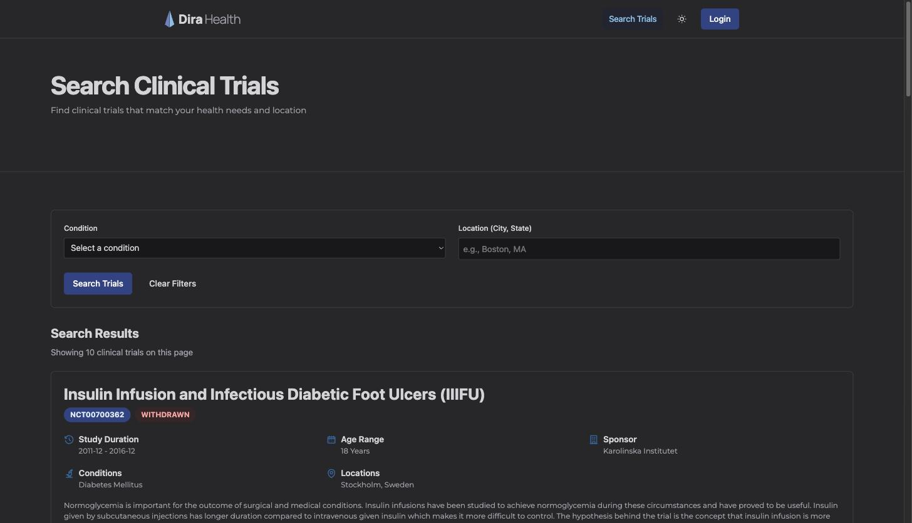

# Dira Health

A clinical trial matching app. It searches ClinicalTrials.gov, scores each study
against a patient profile, and rewrites dense study text into plain language.

**Live:** https://dirahealth-d7ebf98a2caa.herokuapp.com/

You can search without an account. Try
[`/search?condition=diabetes`](https://dirahealth-d7ebf98a2caa.herokuapp.com/search?condition=diabetes).
Saving trials, the onboarding wizard, and the plain-language rewrite need a
signed-in profile, because the rewrite costs a model call per study and the
other two write to one.



More screenshots in [`docs/screenshots/`](docs/screenshots), taken September 2026.

## The problem

ClinicalTrials.gov holds around 500,000 studies. The search is built for
researchers. Eligibility criteria are written for clinicians. A patient trying
to find a trial they qualify for has to read study listings one at a time and
interpret medical language on their own.

This app narrows that. It takes what someone already knows about themselves,
their conditions, age, location, and how far they will travel, and turns the
public trial registry into a ranked list with the eligibility rules spelled out.

## How matching works

`TrialScorer` scores a study against a profile across six weighted criteria.

| Criterion | Weight |
|---|---|
| Conditions | 25 |
| Age | 20 |
| Sex | 20 |
| Location | 15 |
| Study type | 10 |
| Phase and risk tolerance | 10 |

Each returns 0 to 100, and the weighted total maps to a match level. Missing
profile data scores neutral rather than zero, so an incomplete profile is not
punished for what it has not filled in yet.

`EligibilityChecker` runs alongside it and builds a per-study checklist covering
age, sex, recruiting status, conditions, and parsed eligibility criteria. The
score answers how well a trial fits. The checklist answers why.

`ReadableStudySummaryGenerator` sends the study's summary and detailed
description to Claude and asks for plain prose with no medical jargon. The call
runs in a background job. The page shows a placeholder immediately and swaps in
the result over a Turbo Stream broadcast, so a slow model call never blocks a
request. Results are cached per study rather than per user, since the rewrite is
a pure function of public text.

The onboarding wizard collects the profile that all of this reads from. Age,
sex, conditions, and location are required, because a profile missing them
cannot be scored against anything. Each step saves under its own validation
context, so a partial save is not rejected for fields the user has not reached.

## Architecture

```
app/services/
  clinical_trial_client.rb              ClinicalTrials.gov API v2 client
  trial_scorer.rb                       weighted multi-criteria scoring
  eligibility_checker.rb                per-study eligibility checklist
  trial_search_service.rb               search plus scoring
  trial_recommendation_service.rb       profile-driven recommendations
  readable_study_summary_generator.rb   Claude rewrite
  saved_trial_rescorer.rb               batch rescore after a scoring change
  onboarding.rb                         wizard step vocabulary and ordering
  trial_phase.rb                        shared phase vocabulary
  trial_status.rb                       shared recruiting-status vocabulary
```

Notes on a few decisions:

- **Service objects over fat models.** Every external call and every scoring
  rule lives in `app/services`, so the models stay about persistence.
- **ViewComponent for anything reused.** Around 65 components. Cards, icons,
  avatars, pagination, the wizard steps, and the admin stat tiles each have
  their own specs.
- **Background work runs in Puma.** Solid Queue forks a supervisor, worker,
  dispatcher, and scheduler, which measured about 665MB on top of Puma's 231MB
  and does not fit a 512MB dyno. Production uses the `:async` adapter instead.
  Queued jobs are lost on restart, which is an acceptable trade for one
  user-triggered job.
- **Solid Cache and Solid Cable share the primary database.** Heroku provisions
  one database, so the four-database Rails 8 default collapses to one.

## Three things that were harder than they looked

**Every phase score was silently zero.** The v2 API returns phase as an enum,
so a study comes back as `"PHASE4"` or `"PHASE2, PHASE3"` or `"EARLY_PHASE1"`.
`TrialScorer` tested `include?("phase 4")` and `MatchScoreCardComponent` tested
`include?("Phase 4")`. Neither can ever match `"PHASE4"`. Every real phase
string scored 0, which made stating a risk tolerance strictly worse than
leaving it blank. The fix was `TrialPhase`, one shared vocabulary both callers
read from.

**Substring matching on recruiting status is wrong in a way that reads fine.**
`"ACTIVE_NOT_RECRUITING"` contains `"RECRUITING"`. So does
`"NOT_YET_RECRUITING"`. Two closed trials matched an open-trial check. Matching
is now exact against a normalised form in `TrialStatus`, which both the scorer
and the eligibility checker read, so the score and the checklist cannot drift
into disagreeing about whether a trial is open.

**An upgrade broke at load time because nothing exercised it.** `image_processing`
2 dropped `ruby-vips` and `mini_magick` as dependencies, so the backend has to be
declared in the Gemfile rather than arriving for free. Nothing in the app called
`.variant`, so no spec touched the processor and the upgrade failed in CI instead
of locally. The regression spec resizes a real attachment, which means the gem,
the binding, and the native libvips library all have to be present for it to pass.

## Stack

Ruby 3.4.10, Rails 8.1.3, PostgreSQL. Hotwire with Turbo and Stimulus over
importmap, no build step. Tailwind CSS 4 and ViewComponent for the views. Devise
for authentication, Pundit for authorization. Solid Cache and Solid Cable.
Active Storage backed by Cloudflare R2. RSpec and FactoryBot for tests.
Deployed on Heroku.

## Running it locally

Requires Ruby 3.4.10 and PostgreSQL.

```bash
git clone https://github.com/phreeknomenal/trials.git
cd trials
bundle install

# Claude API key, used for readable study summaries
echo "ANTHROPIC_API_KEY=your-key-here" > .env

bin/rails db:prepare   # creates, loads schema, seeds lookup data
bin/dev                # http://localhost:3000
```

`db:prepare` seeds conditions, genders, races, identities, interests, around
41,000 US zip codes, and ten placeholder testimonials. In development it also
creates 29 sample users. Admin accounts use the password `password` in
development only.

Every seed is idempotent, because `seed_production` runs on each Heroku release.

```bash
bundle exec rspec       # 585 examples
bundle exec standardrb  # lint
```

## Test coverage

585 examples as of September 2026. Coverage is uneven and worth stating plainly.

`TrialScorer` is the best covered piece of the app, which is deliberate. It
carries about 700 lines of specs across two files. One covers the six scoring
criteria directly. The other runs the scorer against saved ClinicalTrials.gov
payloads, so a change to the weights shows up as a diff in real scores rather
than as a still-passing unit test.

Request specs cover authentication, authorization, the admin namespace, search,
pagination, the onboarding wizard, and the landing page. Thirteen component
specs cover the buttons, the header and menu, pagination, flash messages, icons,
avatars, and the match score card. Five of fourteen models have specs. That is
the thinnest area and the next thing worth doing.

## Data

Trial data comes from the [ClinicalTrials.gov API
v2](https://clinicaltrials.gov/data-api/api), a public source maintained by the
U.S. National Library of Medicine. The app stores no trial data of its own
beyond saved references and cached plain-language summaries.

The US zip code lookup in `db/seeds/zip_codes.csv` comes from
[GeoNames](https://download.geonames.org/export/zip/), licensed CC BY 4.0. It
maps a zip to a city and full state name so location scoring has something to
compare against a trial's site list. Military APO/FPO rows carry no state and
were dropped.

Testimonials on the landing page are placeholder content for demo purposes.

## License

All rights reserved. Readable for evaluation, not licensed for use. See
[LICENSE](LICENSE).
